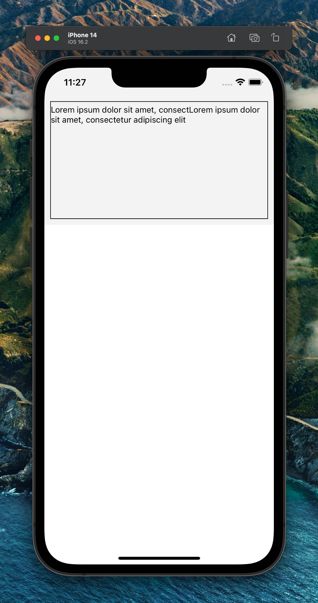

This is a reproduction for https://github.com/facebook/react-native/issues/36494 based on a base RN 0.72 RC1 app.

Reproduction code is in `Repro.tsx`

To repro, launch the app on iOS and see that the `<TextInput>` contains:

> Lorem ipsum dolor sit amet, consectLorem ipsum dolor sit amet, consectetur adipiscing elit

But `value` is initialized with

> Lorem ipsum dolor sit amet, consectetur adipiscing elit

This happens with `multiline` and `maxLenght`, when the initial `value` is longer than `maxLenght / 2`. `onChangeText` and `onChange` are triggered when the component mounts, with `value` prepended to the actual `value` until it fills `maxLenght`.

This does not happen on Android.
